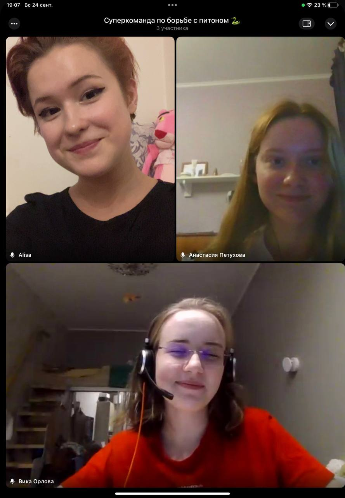

# Homework 4
## Description
In the file `protein_tool.py ` contains the function `protein_tool'. It takes as input the name of the procedure and the sequence of amino acids, or two sequences, in the case of some procedures. This chair is designed for processing protein sequences.

The function returns a string that reflects the results of working with the sequence.

### Consistency Requirements

- - The sequence should be composed of single-letter names of amino acids
- - The sequence can be passed in uppercase or lowercase
- The sequence must contain proteinogenic amino acids, without their modifications

### Available procedures 

We have implemented the following functions:

- `calculate_amino_acid_percentages` - calculation of the relative amino acid composition
- `classify_amino_acid` - counting the relative number of amino acids by class
- `find_amino_acid_indices' - get indexes of all occurrences of AK in protein
- `counting_point_mutations` - counting point mutations and counting the percentage of similarity (sequence length/number of point mutations)
- `counting_molecular_weight' - counting molecular weight
- `get_occurrences` - find the number of occurrences in a sequence of another sequence, indexes and the number of occurrences
- `count_variant_rna` - counting RNA variants that could encode a given sequence
- `determine_total_protein_charge` - determination of the total charge of the protein
- `calculate_pI` - calculation of the approximate isoelectric point


**Description of functions and usage examples**

:computer: Author: Alisa Kabalina


The `count_variant_rna` function accepts a protein sequence (str) as input. After that, the function counts the number of possible RNA variants that can be a matrix for the synthesis of a given amino acid sequence. The result is returned, the number of possible RNAs (int)
```python
protein_tool('TATAQQQWRVVTDDDA', 'count_variant_rna') # '25165824'
```

The `determine_total_protein_charge` function accepts a protein sequence (str) as input. After that, the function determines whether a given amino acid sequence is positively negatively charged or not charged. The result is returned, the string `negative`, `positive`, `neutral`
```python
protein_tool('TDDDTEQQWRVVTDDDA', 'determine_total_protein_charge') # 'negative'
```

The `calculate_pI` function accepts a protein sequence (str) as input. After that, the function calculates the approximate value of the isoelectric point (pI) of a given amino acid sequence. The result is returned, the isoelectric point (float)
```python
protein_tool('TKKKKTDDDA', 'calculate_pI') # '7.225555555555555'
```

:computer: Author: Orlova Victoria.


The `counting_point_mutations` function takes two protein sequences (str) as input. Input sequences must have the same length. After that, the function counts the number of mutations - amino acid substitutions, the result returned is the number of mutations (int).
```python
run_protein_tools('ASQG', 'AMQR', 'counting_point_mutations') # 2
```

The `counting_molecular_weight` function takes a protein sequence (str) as input. The function then counts the molecular weight of the input protein sequence, the result returned is the number of molecular weight (int).
```python
run_protein_tools('ASQGAMQR', 'counting_molecular_weight') # 847
```

The function `get_occurrences` takes as input two protein sequences (str) - seq1 and seq2. After that, the command counts the number of occurrences without intersection of the second protein sequence into the first one. The result is returned as a string (str), where across the space: the number of occurrences of the second string into the first string, followed by the occurrence indices (1 and beyond) across the space.
```python
run_protein_tools('ASQRGARWQRMQR', 'QR', 'get_occurrences') # 'Number of occurrences: 3; indexes: 3, 9, 12'
```


:computer: Author: Petuchova Anastasya


The `calculate_amino_acid_percentages` function takes a protein sequence (str) as input. The command then calculates the percentage of amino acids in the protein, and finally returns the result as a string (str), where the amino acid and its percentage in the protein are written with a colon. The function rounds the result to two decimal places and sorts it in descending order.
```python
run_protein_tools('ADNNDQD', 'calculate_amino_acid_percentages') # 'D: 42.86, N: 28.57, A: 14.29, Q: 14.29'
```

The function `classify_amino_acid` takes a protein sequence (str) as input. The command returns the calculated percentage of neutral, acidic and basic amino acids in the protein as a string (str). The function rounds the result to two decimal places.
```python
run_protein_tools('ARNDCQ', 'classify_amino_acid') # 'neutral: 66.67, acidic: 16.67, basic: 16.67'
```

The `find_amino_acid_indices` function takes as input a protein sequence and an amino acid (str) - seq and amino_acid. After that the command searches for indices of amino acid occurrence in protein and ultimately returns the result as a string (str) with all the indices.
```python
run_protein_tools('ARNDCQA', 'A', 'find_amino_acid_indices') # '1, 7'
```
Using this function you may encounter an error **ValueError: Amino acid not found**.
This error occurs if the entered amino acid is not contained in the protein sequence or it is written in lower case.
```python
run_protein_tools('ARNDCQA', 'E', 'find_amino_acid_indices') # ValueError: Amino acid not found
```
```python
run_protein_tools('ARNDCQA', 'n', 'find_amino_acid_indices') # ValueError: Amino acid not found
```


## :sparkles: Our adorable team meetings! :sparkles:
:two_hearts: :two_hearts: :two_hearts: :blush: :heart_eyes: :blush: :two_hearts: :two_hearts: :two_hearts:

 


:trollface: :trollface: :trollface: :trollface: :trollface: :trollface: :trollface: :trollface: :trollface: :trollface: :trollface: :trollface: :trollface: :trollface: :trollface: :trollface: :trollface: :trollface: :trollface: :trollface: :trollface: :trollface: :trollface: :trollface: :trollface: :trollface: :trollface: :trollface: :trollface: :trollface: :trollface: :trollface: :trollface: :trollface: :trollface: :trollface: :trollface: :trollface: :trollface: :trollface: :trollface:
